# 👋 Hi, I'm Rajat Kumar

**Full Stack & Web3 Developer | React Ecosystem | Hedera Network Builder**  

I specialize in building scalable, secure, and decentralized applications with a clean architecture mindset.  
Currently building **HashBuzz** — a social DApp on Hedera.  

💻 **Tech Stack**  
- React, Next.js, TypeScript  
- Node.js, Express, PHP  
- Solidity, Hedera SDK  
- Redux, RTK Query, Ethers.js  
- AI & Blockchain Integrations  

🌐 [hashbuzz.social](https://hashbuzz.social)

---

## 🚀 My Workflow

```mermaid
flowchart TD
    A["Idea"] --> B["Design Architecture"]
    B --> C["Frontend Development (React + TypeScript)"]
    C --> D["Backend APIs (Node.js + Express)"]
    D --> E["Blockchain Integration (Hedera + Solidity)"]
    E --> F["Testing & Deployment"]
    F --> G["Live DApp 🚀"]
    
    style A fill:#FFD700,stroke:#333,stroke-width:2px
    style G fill:#32CD32,stroke:#333,stroke-width:2px

```

## 📌 Featured Projects

| Project                                                                               | Description                                                   |
| ------------------------------------------------------------------------------------- | ------------------------------------------------------------- |
| **[hashconnectWalletConnect](https://github.com/rajatK012/hashconnectWalletConnect)** | TypeScript-based Hedera wallet integration using HashConnect. |
| **[open-dapp](https://github.com/rajatK012/open-dapp)**                               | Community edition decentralized application (forked).         |
| **[intrest-slider](https://github.com/rajatK012/intrest-slider)**                     | Custom slider component built with TypeScript.                |
| **[ts-coding-challenge](https://github.com/rajatK012/ts-coding-challenge)**           | Hedera SDK Cucumber typescript challenge.                     |

## 🌐 Connect with Me

 - Website: hashbuzz.social(https://hashbuzz.social)
 - Twitter: [@Rajatk0112](x.com/rajatK012)
 - Telegram- @ops295(https://t.me/ops295)

##  📖 Currently Exploring

GraphQL • Microservices • Advanced React Patterns (SWR, Suspense) • Hedera Tokenization

